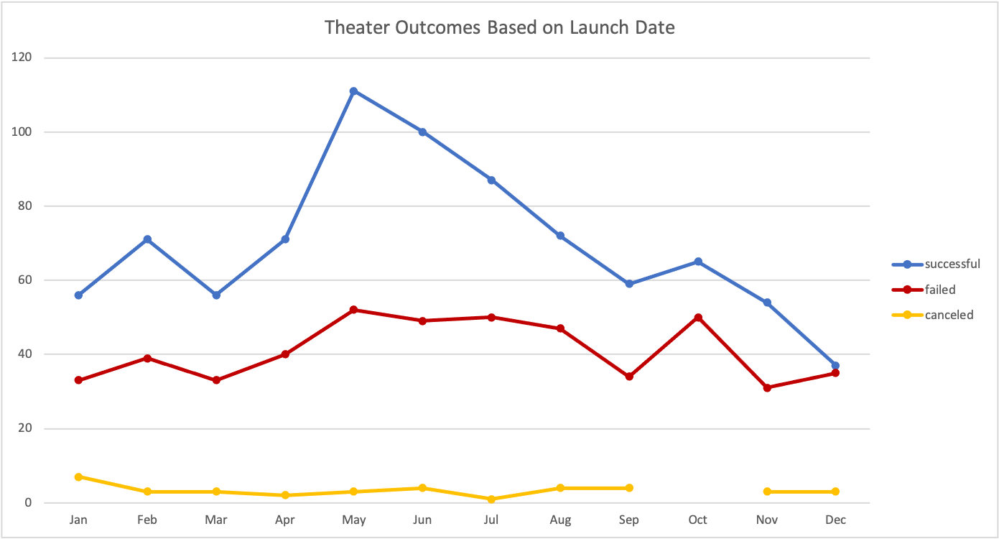
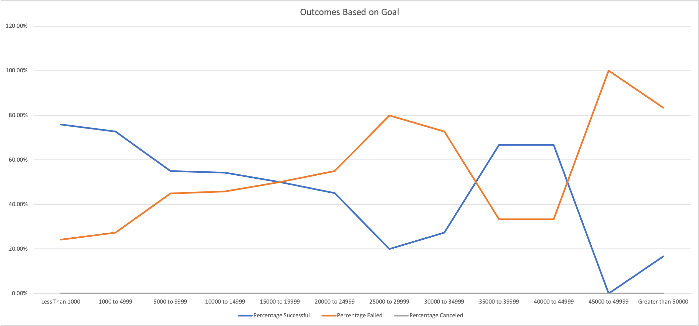

# Kickstarting with Excel

## Overview of Project

### Purpose
   The purpose of this analyses is to provide Louise with insight into how other campaigns fared in relation to her launch dates and funding goals using the Kickstarter dataset. Louise recently created a play named Fever that came close to the fundraising goal in a short amount of time.  This analysis will be very helpful for Louise to not only analyze new tables created form the raw kickstarter data but also visualize our findings with charts.

## Analysis and Challenges

### Analysis of Outcomes Based on Launch Date
   A good way analyze the play outcomes based on launch date was to use a Pivot table and a Pivot Chart.  The Pivot table uses the data form the Kickstarter table organized to filter based on the Parent Category field (theater) and a new field we created Year (based on launch date).  We were most concerned about the different outcomes throughout a calendar year so in the Rows section we used the Date Created Conversion represented by month field and outcomes in our columns section (excluded outcome "Live" because were interested in end results).  For values in the Pivot table, we used a count on the outcomes to give us the total values for each month based on outcomes.  To visualize our data from the Pivot table I created a Pivot Chart to allow flexibility when we filter for different years our Pivot chart will automatically change as well.

### Analysis of Outcomes Based on Goals
   To analyze the different play outcomes based on the financial goal set we took a different approach by creating a new table and set up different currency ranges, or buckets, for our data to fall in (ex: $5000 to $9999).  To get the values for each bucket I used a CountIf formula to count the total number of plays that were successful, failed or canceled based on the goal bucket. Next, I summed the total amount of plays for each goal bucket and then calculated the percent of plays that were successful, failed or canceled.  Lastly, I created a table based on the outcomes and percent successful, failed or canceled by each goal bucket so that we can visualize the data and draw a conclusion.  

### Challenges and Difficulties Encountered
   For the most part, I didn't have many challenges or difficulties with this analysis project because I'm pretty experienced using Microsoft Excel.  I use Excel as one of my main tools for my job as a Reporting Analysis for a financial firm so a lot of this came natural to me.
   One area that I can see classmates experiencing difficulties is with Pivot Tables and formulas based on the Kickstarter data.  Pivot Tables can be tricky at first, understanding how they work and which fields to use to best represent the data.  More complicated formulas like muti If Statements and CountIfs can also be challenging if you aren’t familiar with the formula but once you do it a couple times it becomes second nature.
 
    
## Results

### What are two conclusions you can draw about the Outcomes based on Launch Date?
   By analyzing the outcomes based on launch date, we see a couple clear trends that we can draw a conclusion from. 
   First, plays have a much lower success rate when they are lunched during the end of the year.  This is most likely due to the fact that during the end of the year, customers might be traveling more often to see family for the holidays.
   Second, we see a much higher volume of plays launching during summer months (Apr, May, Jun, Jul and Aug) than we do during winter months.  Consequently, the plays lunched during these summer months also tend to have a higher success rate.
   In conclusion, based on the Kickstarter data, I would recommend lunching the play during one of the summer months, preferably May, and avoid launching a play in December.

### What can you conclude about the Outcomes based on Goals?
   When analyzing the play's outcome based on the financial goal, I first noticed that ~96% of plays fall in the less than $1000 to $24999 buckets.  Within those buckets, we see a clear trend that as the goal is increased the success rate decreases with a point of intersection at the $15000 to 19999 bucket where both success and fail rates are the same. After the $20000 to $24000 bucket our data becomes less conclusive because it only represents ~4% of our data population.  My recommendation to Louise would to set a goal no higher than $15000 because this is within the range where we have enough data where we can draw a clear conclusion from and where we have a higher percent of successful plays than failed plays before we hit a point of intersection.
    
### What are some limitations of this dataset?
   There are two major limitations that come to mind when looking at our Kickstarter dataset.  We have the country in which the kickstarters launched but we don’t have specific religion within the large countries that the kickstarter launched and I would be interested in seeing the success rate of the plays that launched on the east coast vs west coast or if plays were more popular in states with large city populations.  Another limitation is that we know were looking at plays for Louise but we don’t know the genre of play.  It would be interesting to see how different genres (adventure, comedy, romance, non-fiction) fare when we compare plays and goal success rate.

### What are some other possible tables and/or graphs that we could create?
   An interested new table for Louise would be the average donation amount and backers count for each play and how many had successful outcomes.  This could give Louise insight into how many backers and how much she should be asking for to maximize her chances of reaching her goal and having a successful outcome.  Another chart to create would to use the Outcomes Based on Goals table and creating a pie chart using the different goal buckets and number successful.  This would allow her to visualize which goal buckets had the highest number of successful outcomes and you could also do the same for failed outcomes.
